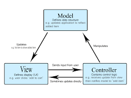

# Laporan Modul 1: Perkenalan Laravel 
**Mata Kuliah:** Workshop Web Lanjut
**Nama:** Fathan Mubina
**NIM:** 2024573010058
**Kelas:** TI-2C

---

## Abstrak
Laravel adalah framework PHP yang populer karena menyediakan struktur pengembangan web yang rapi, fitur yang cukup banyak. Laporan ini bertujuan untuk memperdalam pemahaman mengenai konsep dasar Laravel, mendokumentasikan hasil pembelajaran, serta menilai efektivitas framework ini dalam pengembangan aplikasi web.

---

## 1. Pendahuluan
- Laravel adalah sebuah framework berbasis PHP yang dirancang untuk memudahkan pengembangan aplikasi web modern. Framework ini pertama kali dirilis oleh Taylor Otwell pada tahun 2011 dan sejak itu berkembang pesat menjadi salah satu framework PHP paling populer. Laravel menyediakan kerangka kerja yang terstruktur, sintaks yang elegan, serta berbagai fitur bawaan yang mempercepat proses pengembangan sekaligus menjaga kualitas kode.

- Laravel adalah framework PHP open-source yang menggunakan arsitektur Model-View-Controller (MVC). Dengan MVC, Laravel membantu memisahkan logika aplikasi, tampilan antarmuka, dan manajemen data agar kode lebih terorganisir dan mudah dipelihara.

- Beberapa karakteristik Laravel antara lain:
    - Arsitektur MVC 
        - Memisahkan logika, tampilan, dan data sehingga aplikasi lebih terstruktur.
    - Opinionated Framework
        - Laravel menawarkan “cara baku” dalam menyusun kode, sehingga memudahkan developer    mengikuti standar yang sama.
    - Eloquent ORM
        - Sistem ORM bawaan untuk berinteraksi dengan database secara object-oriented.
    - Migration & Seeder
        - Mempermudah pengelolaan struktur database serta pengisian data awal.
    - Fitur Keamanan
        - Mendukung proteksi CSRF, hashing password, dan enkripsi data.
    - Ekosistem Lengkap
        - Dilengkapi dengan Composer, Laravel Mix, Artisan CLI, hingga Laravel Breeze/Fortify untuk autentikasi.

- jenis aplikasi web yang cocok untuk laravel adalah sebagai berikut 
    - Website perusahaan atau organisasi.
    - Aplikasi e-commerce dengan fitur produk, keranjang belanja, dan pembayaran.
    - Sistem manajemen konten (CMS).
    - Aplikasi berbasis API untuk mobile maupun web service.
    - Sistem informasi internal seperti sistem kepegawaian, akademik, atau inventaris.

---

## 2. Komponen Utama Laravel (ringkas)
Tuliskan penjelasan singkat (1–3 kalimat) untuk tiap komponen berikut:
- Blade (templating)
    - Blade adalah templating engine bawaan Laravel untuk merender view. Kita dapat mengirim data dari basis data atau sumber lain ke dalam view.
- Eloquent (ORM)
    - Eloquent adalah ORM bawaan Laravel untuk berinteraksi dengan basis data. Dengan Eloquent, kita tidak perlu menulis query SQL mentah. 
- Routing
    - Sistem routing Laravel sangat dinamis dan mudah digunakan. Mendukung URL pattern, middleware, route grouping, serta resource route.
- Controllers
    - Controllers berfungsi sebagai penghubung antara model dan view, menangani logika aplikasi serta mengatur data yang akan ditampilkan ke pengguna.
- Migrations & Seeders 
    - Migration mempermudah pengelolaan struktur database secara versioning, sedangkan Seeder digunakan untuk mengisi data awal atau contoh data ke dalam database.
- Artisan CLI 
    - Artisan adalah command line interface bawaan Laravel yang menyediakan berbagai perintah untuk mempercepat proses pengembangan, seperti membuat controller, model, migration, dan menjalankan server.
- Testing (PHPUnit) 
    - Laravel juga mendukung pengujian aplikasi berbasis PHPUnit untuk memastikan fungsi aplikasi berjalan dengan benar serta menjaga kualitas kode.

---

## 3. Berikan penjelasan untuk setiap folder dan files yang ada didalam struktur sebuah project laravel.
- app
    - Berisi inti logika aplikasi, termasuk Models, Http (Controllers, Middleware, Requests), dan Console. Semua kode aplikasi utama ditulis di sini.
- bootstrap
    - Berisi file untuk bootstraping framework, seperti app.php yang menginisialisasi Laravel. Ada juga folder cache/ untuk file cache bootstrap.
- config
    - Menyimpan file konfigurasi aplikasi, misalnya konfigurasi database (database.php), mail, cache, session, queue, dan lain-lain.
- database 
    - Berisi file migrations, seeders, dan factories yang digunakan untuk mengatur struktur dan data awal pada database.
- public
    - Folder yang menjadi root akses web server. Di sini terdapat file index.php (entry point aplikasi) serta file aset seperti CSS, JS, dan gambar.
- resources
    - Menyimpan resource aplikasi, seperti views (Blade templates), file lang (terjemahan), dan assets (SASS, JS, dll.) yang biasanya akan dikompilasi dengan Laravel Mix/Vite.
- routes
    - Berisi definisi routing aplikasi, seperti web.php (untuk halaman web), api.php (untuk API), console.php, dan channels.php (untuk broadcast).
- storage 
    - Digunakan untuk menyimpan file yang dihasilkan aplikasi, misalnya logs, cache, compiled views, dan file upload. Terdiri dari app/, framework/, dan logs/.
- tests 
    - Folder untuk menulis pengujian aplikasi (testing). Biasanya ada Feature/ untuk pengujian level fitur, dan Unit/ untuk pengujian unit.
- vendor 
    - Berisi semua package dan dependency yang diinstal lewat Composer, termasuk core Laravel itu sendiri.
- artisan
    - CLI bawaan Laravel untuk menjalankan berbagai perintah.
- composer.json  
    - Berisi dependency PHP project (untuk Composer).
- package.json 
    - Berisi dependency frontend (npm/yarn, misalnya untuk Vite atau Laravel Mix).
- .env 
    - File konfigurasi lingkungan (environment), misalnya database, mail, APP_KEY.
- .gitignore 
    - Menentukan file/folder yang diabaikan oleh Git.

---

## 4. Diagram MVC dan Cara kerjanya

- Model
    - Model menentukan data apa yang harus ada di dalam aplikasi. Jika status data ini berubah, model biasanya akan memberi tahu view (agar view dapat diubah sesuai kebutuhan) dan terkadang controller (jika logika yang berbeda diperlukan untuk mengontrol view yang diperbarui).
- View
    - View menentukan bagaimana data aplikasi akan ditampilkan.
    - Dalam aplikasi daftar belanja, tampilan akan menentukan bagaimana daftar disajikan kepada pengguna, dan menerima data untuk ditampilkan dari model.
- Controller
    - Controller berisi logika yang memperbarui model dan/atau tampilan sebagai respons terhadap masukan dari pengguna aplikasi.

---

## 6. Kelebihan & Kekurangan (refleksi singkat)
- Kelebihan Laravel menurut Anda
    1. Laravel bersifat open source.
    2. Mempunyai blade template.
    3. Punya dokumentasi yang lengkap dan rapi.

- Hal yang mungkin menjadi tantangan bagi pemula
    1. Sering mealakukan update dalam jangka waktu yg singkat
    2. Memiliki ukuran yg cukup besar dibandingkan framwork php lain

---

## 7. Referensi
Cantumkan sumber yang Anda baca (buku, artikel, dokumentasi) — minimal 2 sumber. Gunakan format sederhana (judul — URL).

- Laravel - The PHP Framework For Web Artisans - https://laravel.com/docs
- 10 Jenis Aplikasi Web Berbeda yang Dibuat dengan Laravel - https://www.sufalamtech.com/blog/web-applications-create-with-laravel
---