# Laporan Modul 2: Laravel Fundamental
**Mata Kuliah:** Workshop Web Lanjut   
**Nama:** Fathan Mubina  
**NIM:** 2024573010058  
**Kelas:** TI-2C  

---

## Abstrak 
dalam laporan praktikum ini kita akan membahas serta hasil dari aplikasi sederhana yg kita buat di framework laravel, yaitu aplikasi kalkulator dan aplikasi untuk menampilkan sebuah teks"Welcome to Laravel 12", tujuan dari praktikum ini adalah untuk memahami dasar-dasar dari laravel seperti pola MVC, cara kerja routing, menggunakan controller, dan memakai view dengan Blade Temolating Engine. 

---

## 1. Dasar Teori
- Apa itu MVC (Model, View, Controller).  
Untuk mengembangkan website atau aplikasi, developer dan programmer membutuhkan kerangka atau framework berisi kode agar situs atau aplikasi bisa berfungsi dan melakukan tugas tertentu dengan baik.  
Ada banyak jenis framework yang digunakan untuk web development, salah satunya adalah MVC.   
Dikutip dari Geeks for Geeks, Model View Controller atau disingkat MVC adalah pola arsitektur atau desain yang membagi kode pada aplikasi menjadi tiga komponen, yaitu model, view, dan controller. Setiap komponen memiliki peran masing-masing namun saling berkaitan.  
Karena dibagi menjadi tiga komponen atau unit, pemeliharaan dan pengoptimalan sistem jadi lebih mudah. Cara kerja ini populer disebut dengan separation of concerns. 

- Konsep Routing di Laravel.
Routing sendiri adalah proses pengiriman data maupun informasi ke pengguna melalui sebuah permintaan yang dilakukan kepada alamat yang sudah terdaftar, lalu alamat tersebut akan memproses dari permintaan kita tadi. Setelah proses selesai maka akan mengembalikan sebuah output atau hasil dari proses tersebut.
Di dalam folder project laravel, disana terdapat folder routes. Dimana terdapat file yaitu console.php, dan web.php. file ini memiliki fungsi masing-masing yaitu.  
    * console.php: File ini digunakan untuk membuat routing command yang berjalan di terminal. Jadi kita juga bisa membuat perintah artisan kita sendiri.
    * web.php: File ini digunakan untuk membuat routing web biasa.

- Fungsi Middleware.  
Middleware adalah perangkat lunak yang berfungsi sebagai jembatan antara aplikasi, perangkat lunak, atau sistem yang berbeda dalam suatu arsitektur teknologi informasi. Istilah "middleware" pertama kali muncul pada tahun 1968, dan sejak itu, middleware telah berkembang menjadi elemen kunci dalam banyak sistem komputer modern. Lalu Apa itu middleware? Middleware bertindak sebagai perantara yang memungkinkan komunikasi dan pengelolaan data antara berbagai komponen aplikasi yang berjalan di satu atau lebih server.

- Bagaimana cara Laravel menangani Request dan Response.  
Laravel menangani request dan response melalui siklus hidup aplikasi (Request Lifecycle) yang melibatkan beberapa komponen utama aeperti: Routing, Middleware, Controller, Model, dan View. Request dari klien diproses oleh HTTP kernel, diteruskan melalui serangkaian middleware untuk modifikasi, ditangani oleh controller yang sesuai, dan akhirnya menghasilkan objek response yang kemudian dikembalikan ke klien.

- Peran Controller dan View.
    * Controller.  
    Komponen controller berfungsi sebagai penghubung antara model dengan view.  
    Tugas controller hanyalah memproses data dan permintaan yang masuk, kemudian memberitahu komponen model apa yang harus dikerjakan, dan hasilnya akan ditampilkan oleh komponen view. 

    * View.  
    Komponen view bertanggung jawab untuk membuat tampilan muka (UI/user interface) pada seluruh situs atau aplikasi.  
    Komponen ini dibuat dari data yang dikumpulkan oleh model, dan diberikan kepada view melalui komponen controller. Namun pada beberapa kasus, view bisa berinteraksi langsung dengan model tanpa bantuan controller. 

- Fungsi Blade Templating Engine.  
Blade templating adalah sistem template bawaan dari Laravel yang memungkinkan kita untuk membuat tampilan web dengan cara yang lebih rapi dan terstruktur.  
Dengan Blade, kita bisa membuat bagian-bagian dari halaman web, seperti header atau footer, yang bisa digunakan kembali di banyak halaman tanpa perlu menulis ulang kode. Tentunya, hal ini membuat proses pengembangan web lebih cepat dan mudah.  
Blade juga menyediakan fitur sederhana untuk menggabungkan logika PHP dengan HTML, seperti menampilkan data dari database atau memeriksa kondisi tertentu, menggunakan sintaks yang mudah dibaca dan dipahami.  
---

## 2. Langkah-Langkah Praktikum
Tuliskan langkah-langkah yang sudah dilakukan, sertakan potongan kode dan screenshot hasil.

2.1 Praktikum 1 – Route, Controller, dan Blade View

- Tambahkan route pada routes/web.php dengan ketik kode seperti di gambar berikut
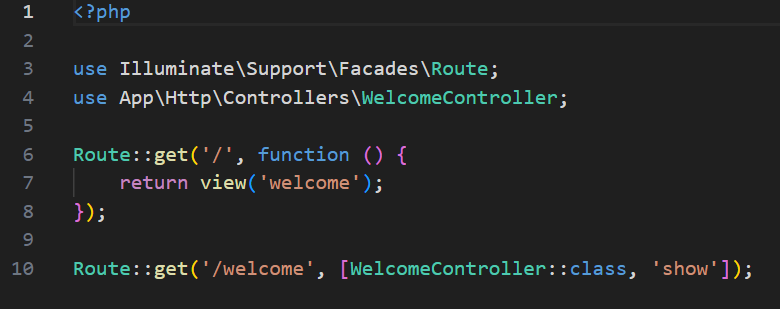

- Buat controller WelcomeController.  
untuk membuat file WelcomeController kita hanya perlu ketik ```php artisan make:controller WelcomeController``` di bash, setelah itu masuk ke dalam file nya dan isi dengan kode berikut.
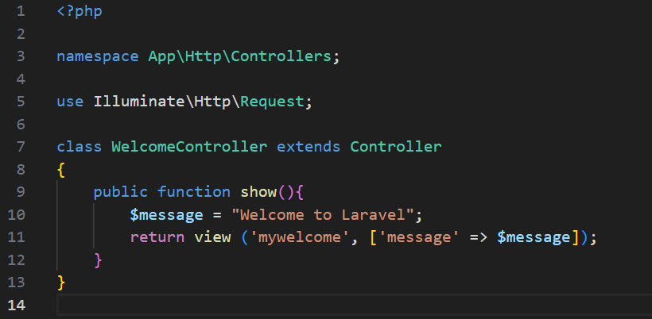

- Buat view mywelcome.blade.php.  
buka folder resource/views, setalah itu buat file baru dengan nama "mywelcome.blade.php" 
isi file tersebut dengan kode berikut
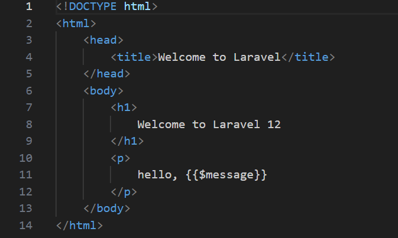

- Jalankan aplikasi dan tunjukkan hasil di browser.
Screenshot Hasil:
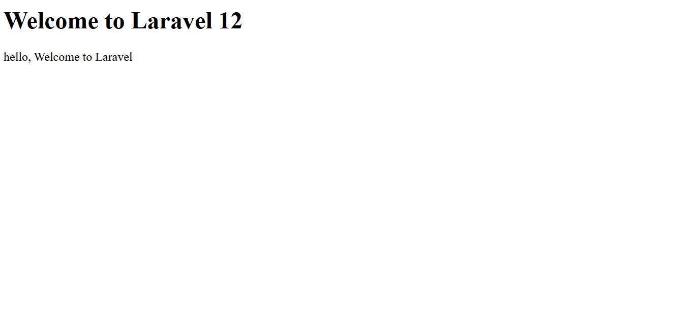

2.2 Praktikum 2 – Membuat Aplikasi Sederhana "Calculator"

- Tambahkan route untuk kalkulator.  
isi routes/web.php dengan kode berikut.  
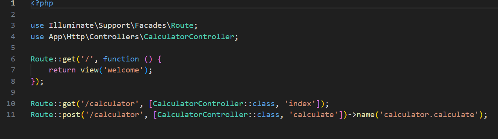

- Buat controller CalculatorController.
buat file controllernya dengan ketik ```php artisan make:controller CalculatorController```
isi file dengan kode berikut.
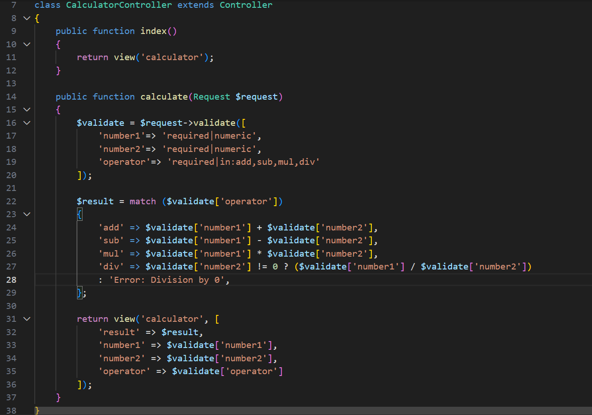

- Tambahkan view calculator.blade.php.
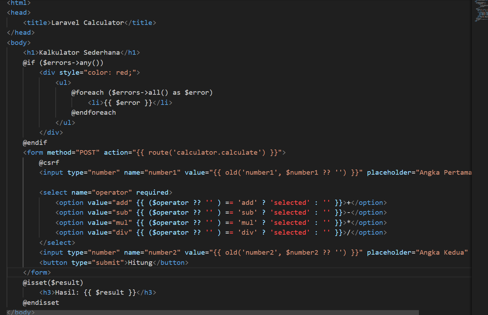

- Jalankan aplikasi dan coba dengan beberapa input berbeda.
Screenshot Hasil:
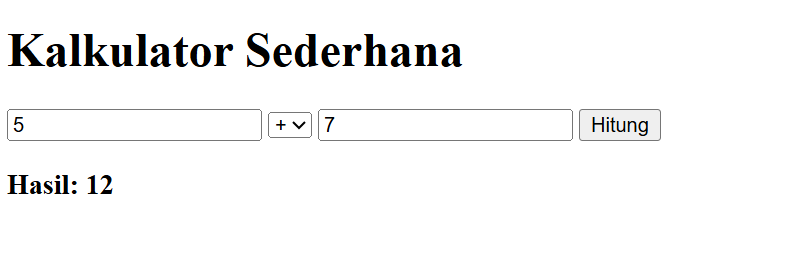
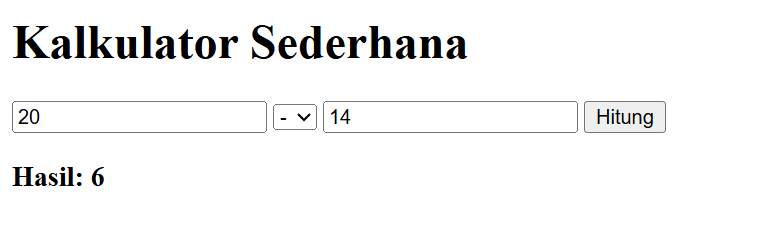
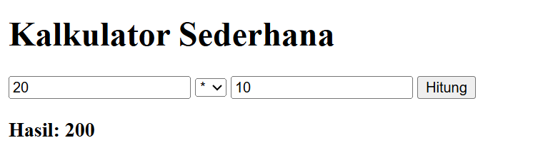
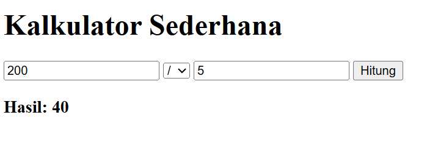
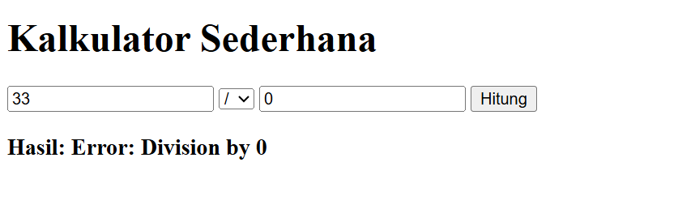

---

## 3. Hasil dan Pembahasan
Jelaskan apa hasil dari praktikum yang dilakukan.
- Apakah aplikasi berjalan sesuai harapan?.  
kedua projek tersebut berjalan sesusai harapan, pada projek pertama yaitu menampilakan teks sederhana melalui route dan controller, ketika kita mengakses url ```http:localhost:8000/welcome``` maka web akan menampilkan teks "Welcome to Laravel 12".  
begitu juga dengan proyek yang kedua yaitu kalkulator sederhana, saat kita megakses url ```http://127.0.0.1:8000/calculator``` web akan menampilkan sebuah kalkuklator sederhana, kalkulator tesebut dapat menerima dua input angka dan satu operator (penjumlahan, pengurangan, perkalian, pembagian). Hasil perhitungan ditampilkan sesuai input yang diberikan oleh kita.  
Secara keseluruhan, kedua project berhasil dijalankan sesuai harapan. Project pertama membuktikan dasar routing dan controller pada Laravel, sementara project kalkulator menunjukkan bagaimana Laravel dapat digunakan untuk menangani input.

- Apa yang terjadi jika ada input yang salah (misalnya pembagian dengan 0)?.  
Jika terjadi input salah (misalnya salah satu angka kosong, bukan angka, atau pembagian dengan 0), sistem menampilkan pesan "Please fill out this field" di angka yang kosong. Kalau pembagian dengan 0, akan muncul pesan  “Error Division by 0”.

- Bagaimana validasi input bekerja di Laravel?  
Validasi input pada Laravel dilakukan menggunakan ```validate()``` yang berada di controller. Laravel akan otomatis memastikan, apakah data sudah sesuai, dan jika gagal maka kita akan diarahkan kembali ke form dengan pesan kesalahan.

- Apa peran masing-masing komponen (Route, Controller, View) dalam program yang dibuat?  
    * Route   
    mengatur URL yang bisa digunakan oleh kita dan menentukan metode controller apa saja yang bisa dipanggil.

    * Controller   
    berfungsi sebagai logika di aplikasi, mulai dari validasi pada input hingga melakukan pemrosesan data.

    * View  
    berfungsi sebagai penyedia antarmuka, menampilkan form input, pesan error, hasil perhitungan, Dan teks sederhana seperti “Welcome to Laravel 12”. 

---

## 4. Kesimpulan
Berdasarkan praktikum yang kita lakukan, dapat disimpulkan bahwa Laravel sebagai framework PHP menyediakan struktur kerja MVC yang memudahkan untuk membuat aplikasi web. Melalui project sederhana berupa kalkulator dan menampilkan teks "Welcome to Laravel 12", kita dapat memahami dasar-dasar dari routing, controller, view, validasi input, dan cara menggunakan Blade templating.


---

## 5. Referensi
Cantumkan sumber yang Anda baca (buku, artikel, dokumentasi) — minimal 2 sumber. Gunakan format sederhana (judul — URL).  

- Apa itu MVC? Arti, Fungsi, Contoh, FAQs 2025 - https://www.revou.co/id/kosakata/mvc  

- Apa Itu Middleware? Pengertian, Contoh dan Fungsinya  https://www.codepolitan.com/blog/apa-itu-middleware-pengertian-contoh-dan-fungsinya  

- Belajar Laravel Bagian 4: Sistem Templating Blade di Laravel - https://www.rumahweb.com/journal/belajar-laravel-bagian-4
---
