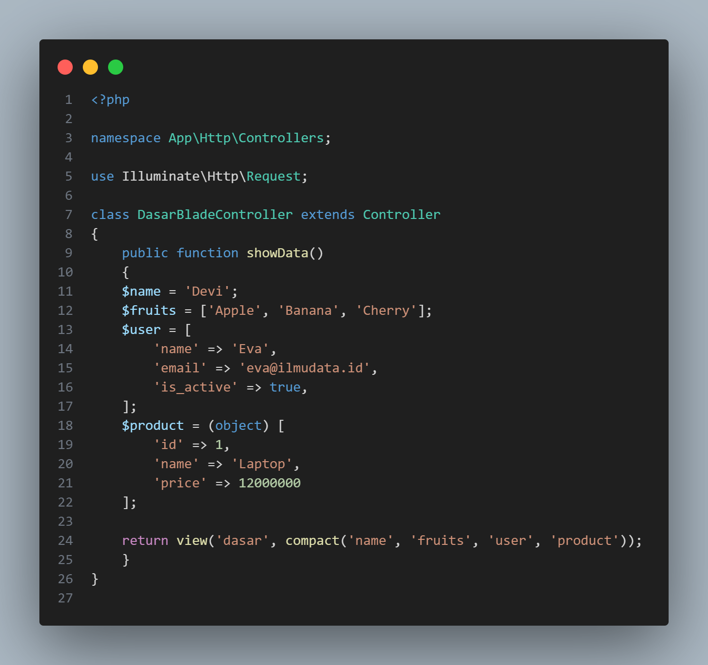
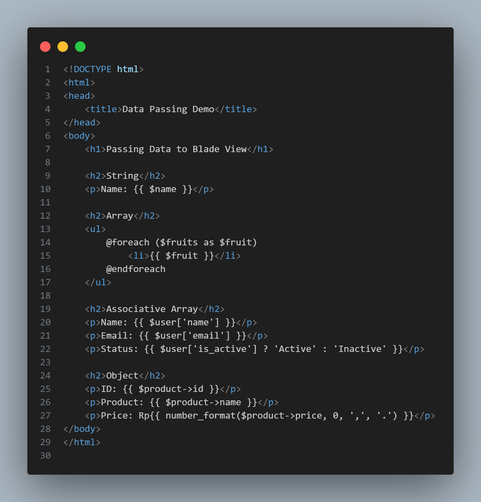

# Laporan Modul 4: Laravel Blade Template Engine

**Mata Kuliah:** Workshop Web Lanjut  
**Nama:** Fathan Mubina  
**NIM:** 2024573010058  
**Kelas:** TI-2C

---

## Abstrak
Praktikum ini membahas penggunaan Blade Template Engine pada framework Laravel sebagai alat untuk mengelola tampilan (view) secara efisien, modular, dan dinamis. Tujuan dari kegiatan ini adalah agar mahasiswa memahami cara meneruskan data dari controller ke view, menggunakan struktur kontrol pada Blade, serta membangun layout dengan konsep templating, partial view, dan komponen. Dalam praktikum dilakukan empat percobaan, yaitu: meneruskan data dari controller ke Blade, penggunaan struktur kontrol, pembuatan layout dengan Bootstrap, serta implementasi partial views dan Blade components. Hasil praktikum menunjukkan bahwa Blade Template Engine mempermudah pengembangan antarmuka pengguna dengan kode yang lebih terorganisir, dapat digunakan kembali (reusable), dan mudah dipelihara. Dengan demikian, penggunaan Blade dapat meningkatkan produktivitas serta konsistensi tampilan dalam pengembangan aplikasi Laravel.

---

## 1. Dasar Teori
Laravel adalah salah satu framework PHP modern yang menerapkan pola arsitektur Model-View-Controller (MVC). Dalam arsitektur ini, bagian View bertanggung jawab menampilkan data kepada pengguna. Untuk mengelola tampilan dengan lebih efisien, Laravel menyediakan sistem template bawaan bernama Blade Template Engine.  
Blade Template Engine merupakan mesin templating yang ringan, cepat, dan mudah digunakan untuk memisahkan logika pemrograman dari tampilan antarmuka. Blade memungkinkan penggunaan sintaks yang lebih sederhana dibandingkan PHP murni, seperti penggunaan @if, @foreach, @extends, dan @include. Dengan Blade, pengembang dapat membuat tampilan yang lebih terstruktur, mudah dipelihara, serta mendukung konsep template inheritance dan component-based design.  

Beberapa fitur utama dari Blade Template Engine antara lain:  

- Template Inheritance — memungkinkan satu layout dasar digunakan oleh beberapa halaman dengan menggunakan direktif @extends dan @section.  
- Component dan Partial Views — membantu memecah tampilan besar menjadi bagian kecil yang dapat digunakan kembali, seperti header, footer, dan sidebar.
- Control Structures — mendukung logika seperti if, foreach, dan for langsung di dalam file Blade dengan sintaks yang sederhana.  
- Data Binding — memungkinkan data dari controller dikirim ke view dan ditampilkan menggunakan tanda kurung kurawal ganda {{ }} secara aman.  
- Integrasi Bootstrap dan UI — Blade dapat dipadukan dengan framework CSS seperti Bootstrap untuk mempercepat pembuatan tampilan yang responsif dan menarik.  

Dalam konteks pengembangan aplikasi web, Blade memegang peranan penting dalam meningkatkan modularitas, efisiensi, dan konsistensi tampilan antar halaman. Dengan memanfaatkan fitur seperti komponen, layout, dan partial view, proses pengembangan front-end menjadi lebih terstruktur dan produktif.

---

## 2. Langkah-Langkah Praktikum

### Praktikum 1: Meneruskan Data dari Controller ke Blade View

1. Langkah 1: Buat dan Buka Proyek laravel  
    - laravel new modul-4-blade-view
    - cd modul-4-blade-view
    - code .

2. Langkah 2: Buat Sebuah Controller
php artisan make:controller DasarBladeController,  
ini akan membuat file di app/Http/Controllers  
DasarBladeController.php.

3. Langkah 3: Definisikan Rute
Buka file Routes/Web.php Dan isi dengan code berikut:  

4. Langkah 4: Buat Metode Untuk menghandle Data pada Controller
Buka app/Http/controllers/dasarbladecontroller.php
Isi Dengan Code Berikut:  

5. Langkah 5: Buat Blade View
Buat File Baru di Direktori resources/views/dasar.blade.php.  
Isi Dengan Code Berikut

6. Langkah 6: Uji Rute
Hidupkan server dengan ketik:  
Php Artisan serve  
Buka Browser Dan Kunjungi link
http://127.0.0.1:8000/dasar  

### Praktikum 2: Menggunakan Struktur Kontrol Blade

1. Langkah 1: Buat Controller Baru  
  Di Dalam Project Modul-4-blade-view Bikin controller  
  php artisan make:controller LogicController  
  Ini akan membuat file app/Http/Controllers LogicController.php.

2. Langkah 2: Tambahkan route baru  
  Buka routes/web.php dan tambahkan:  
        

3. Langkah 3: Tambahkan Logika Di Controller  
  isi dengan code berikut:  
     

4. Langkah 4: Buat Blade View  
  Buat file view Di direktori resources/views/logic.blade.php:  
  Kemudian Isi Dengan Code Berikut:  
     

5. Langkah 5: Jalankan Aplikasi
  Jalankan Server Pengembangan  
  php artisan serve  
  Masuk ke aplikasi pada link berikut:
  http://127.0.0.1:8000/logic  
  

### Praktikum 3: Layout dan Personalisasi di Laravel 12 dengan Bootstrap

1. Langkah 1: Buat Controller baru
  Masih Sama Di dalam Projek modul-4-view, buatlah controller untuk menangani rute dan logika:
  php artisan make:controller PageController

2. Langkah 2: Menambahkan Route
  Di Dalam Routes/web.php kita akan menambahkan rute baru:
  berikut adalah codenya:  
        

3. Langkah 3: Update Controller
  Di dalam direktori app/Http/Controllers/PageController.php Isikan Kode Berikut:  
         
    
4. Langkah 4: Buat Layout Dasar dengan Bootstrap.  
  Di dalam direktori resources/view bikin folder layouts kemudian di dalamnya buat file app.blade.php,  
  isi dengan code berikut:  
  

5. Langkah 5: Buat view untuk Admin  
  Buat direktori admin di resources/views.
  Kemudian buat resources/views/admin/dashboard.blade.php:
  Dan masukkan Code Berikut ini:  
  

6. Langkah 6: Buat view untuk User  
  Buat direktori user di resources/views
  Kemudian, buat resources/views/user/dashboard.blade.php:
  Dan masukkan dengan Code Berikut ini:
  

7. Langkah 7: Jalankan Aplikasi  
  php artisan serve  
  Buka browser dan kunjungi  
  - Admin: http://127.0.0.1:8000/admin  
  - User: http://127.0.0.1:8000/user  

  Hasilnya:  
    
  

### Praktikum 4: Partial Views, Blade Components, dan Theme Switching di Laravel 12

 1. Langkah 1: Buat Dan Buka Proyek Laravel Baru  
  - laravel new modul-4-laravel-ui  
  - cd modul-4-laravel-ui  
  - code .  

 2. Langkah 2: Buat Controller  
  Ketik ini di bash:  
  php artisan make:controller UIController

 3. Langkah 3: Definisikan Routes  
  Buka Routes/web.php Dan Tambahkan Code Berikut:  
  

 4. Langkah 4: Update Controller  
  Buka File UIController.php di Direktori app/Http/Controllers/UIController.php  
  Kemudian Isi dengan Code Berikut:  
  

 5. Langkah 5: Buat Layout Utama Dengan Theme Support  
  Buat Direktori layout di resources/view kemudian Bikin File 
  app.blade.php.  
  isi Dengan Code Berikut:  
  

 6. Langkah 6: Buat Partial View  
  Buat Direktori Partial Di resources/view/partials dan bikin file
  navigation.blade.php  
  kemudian isi code Berikut:  
  

 7. Langkah 7: Buat Blade Components  
  Ketik ini di dalam bash:
    - php artisan make:component Footer
    - php artisan make:component FeatureCard
    - php artisan make:component TeamMember
    - php artisan make:component ContactForm  

Edit resources/views/components/footer.blade.php:  
Isi Dengan Code Berikut:  
  
Edit resources/views/components/feature-card.blade.php  
Isi Dengan Code Berikut:  
  
Dan Edit resources/view/components/team-member.blade.php  
Isi Dengan Code Berikut:  
  

 8. Langkah 8: Buat Main Views
   Buat View-view Utama:
   - resources/views/home.blade.php
   Isi Dengan Code Berikut:
   
   - resources/views/about.blade.php
   Isi Dengan Code Berikut:
   
   - resources/views/partials/team-stats.blade.php
   Isi Dengan Code Berikut:  
   
   - resources/views/contact.blade.php 
   Isi Dengan Code Berikut:  
   
   - resources/views/components/contact-form.blade.php
   Isi dengan Code Berikut:
   
   - resources/views/profile.blade.php
   Isi Dengan Code Berikut:
   

   Langkah 9: Jalankan Dan Test Aplikasi  
   Jalankan php artisan serve di bash  
   Buka Browser Dan kunjungi:
   * Home:    http://127.0.0.1:8000  
   * about:   http://127.0.0.1:8000/about  
   * Contact: http://127.0.0.1:8000/contact  
   * Profile: http://127.0.0.1:8000/profile  

   Berikut Gambar hasilnya:  
   - Hasil Home:  
     
   - Hasil About:  
     
   - Hasil Contact:  
     
   - Hasil Profile:  
     

---

## 3. Hasil dan Pembahasan
### Praktikum 1: Meneruskan Data dari Controller ke Blade View
Pada praktikum ini, dilakukan percobaan untuk meneruskan data dari controller ke view menggunakan Blade. Dengan membuat controller bernama DasarBladeController, data dikirim melalui fungsi return view() beserta variabel yang di-passing. Di sisi view (dasar.blade.php), data tersebut ditampilkan menggunakan sintaks {{ $variabel }}.  
Hasilnya, data dari controller berhasil ditampilkan di browser melalui URL http://127.0.0.1:8000/dasar. Hal ini menunjukkan bahwa proses komunikasi antara controller dan view pada Laravel berjalan dengan baik menggunakan Blade.  

### Praktikum 2: Menggunakan Struktur Kontrol Blade
Praktikum kedua berfokus pada penggunaan struktur kontrol seperti @if, @else, @foreach, dan @for di dalam template Blade. Controller yang digunakan adalah LogicController, yang mengirimkan data array ke view.  
Pada file view (logic.blade.php), data tersebut ditampilkan dalam bentuk daftar menggunakan struktur @foreach. Hasil pengujian menunjukkan bahwa logika percabangan dan perulangan Blade dapat dijalankan dengan benar tanpa perlu menulis kode PHP secara langsung, sehingga tampilan menjadi lebih rapi dan mudah dibaca.  

### Praktikum 3: Layout dan Personalisasi dengan Bootstrap  
Pada praktikum ini, mahasiswa membuat layout utama menggunakan Bootstrap agar tampilan menjadi lebih menarik dan responsif. Struktur layout disimpan dalam file layouts/app.blade.php, kemudian digunakan oleh halaman admin/dashboard.blade.php dan user/dashboard.blade.php melalui direktif @extends.
Hasil yang diperoleh menunjukkan bahwa konsep template inheritance pada Blade sangat memudahkan pengelolaan tampilan yang memiliki struktur serupa, seperti halaman admin dan user. Dengan demikian, perubahan pada satu file layout otomatis diterapkan ke seluruh halaman yang mewarisinya.

### Praktikum 4: Partial Views, Blade Components, dan Theme Switching  
Praktikum terakhir membahas implementasi partial view dan Blade components untuk membangun tampilan yang modular serta mendukung theme switching. Beberapa komponen seperti Footer, FeatureCard, TeamMember, dan ContactForm dibuat menggunakan perintah artisan php artisan make:component.  
Setiap komponen memiliki file Blade sendiri dan dapat digunakan kembali di berbagai halaman seperti home.blade.php, about.blade.php, contact.blade.php, dan profile.blade.php.  
Hasilnya menunjukkan bahwa penggunaan komponen dan partial view membuat kode tampilan lebih terstruktur, mudah dikelola, dan dapat digunakan kembali (reusable). Selain itu, konsep theme switching memungkinkan tampilan aplikasi diubah tanpa perlu memodifikasi setiap halaman secara manual.  

Secara keseluruhan, keempat praktikum ini membuktikan bahwa Blade Template Engine pada Laravel sangat efektif dalam membangun tampilan web yang dinamis, modular, dan efisien. Penggunaan fitur Blade juga mempercepat proses pengembangan dan meminimalkan duplikasi kode.  

---

## 4. Kesimpulan
Berdasarkan hasil praktikum yang telah dilakukan, dapat disimpulkan bahwa Blade Template Engine merupakan salah satu fitur penting dalam framework Laravel yang berfungsi untuk memisahkan logika pemrograman dari tampilan (view) dengan cara yang efisien, terstruktur, dan mudah dipelihara. Melalui empat percobaan yang mencakup penerusan data dari controller ke view, penggunaan struktur kontrol seperti @if dan @foreach, penerapan layout dengan Bootstrap, serta pembuatan partial views dan Blade components, mahasiswa dapat memahami bagaimana Blade mempermudah proses pengembangan tampilan web. Penggunaan Blade Template Engine tidak hanya mempercepat proses pembuatan antarmuka pengguna, tetapi juga meningkatkan konsistensi, keteraturan struktur kode, serta memungkinkan tampilan yang lebih dinamis dan mudah dikembangkan. Dengan demikian, Blade memberikan kontribusi besar dalam menciptakan aplikasi Laravel yang efisien, terorganisir, dan profesional.

---

## 5. Referensi
- Modul 2 - Laravel Fundamentals - https://hackmd.io/@mohdrzu/r1AIUzWpll
- Laravel Documentation — Blade Templates. https://laravel.com/docs/12.x/blade
- Tutorialspoint — Laravel Blade Templates. https://www.tutorialspoint.com/laravel/laravel_blade_templates.htm

---
