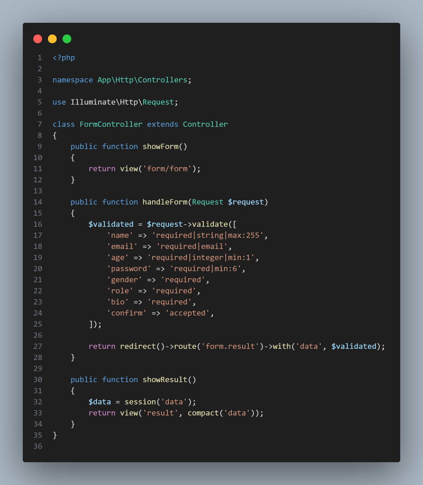
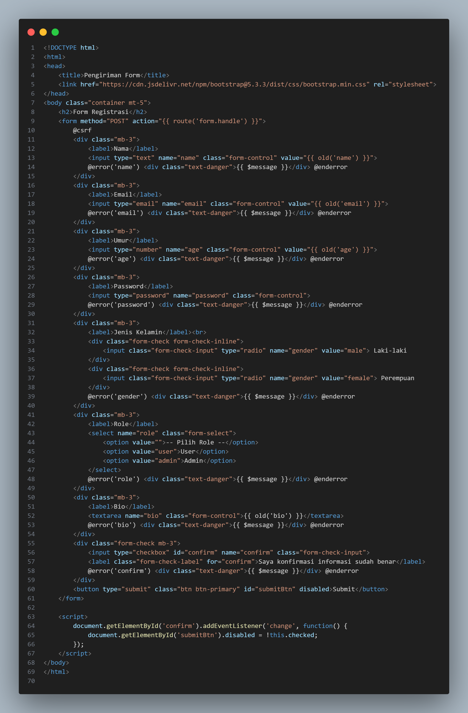

# Laporan Modul 5: Form Submission & Data Validation

**Mata Kuliah:** Workshop Web Lanjut  
**Nama:** Fathan Mubina  
**NIM:** 2024573010058  
**Kelas:** TI-2C

---

## Abstrak
Pada modul ini pembelajaran yang dilakukan adalah mengenai Form Submission dan Data Validation menggunakan framework Laravel 12. Dalam praktikum ini penanganan data dari form dan bagaimana memvalidasi input data pengguna dilakukan serta pengamanan pengiriman data dalam Laravel yang dilakukan menggunakan Form Request Validation dan CSRF Protection. Selain itu, juga dilakukan pengimplementasian multi-step form dalam mengelola data pengguna secara bertahap melalui session. Sebagian besar hasil praktikum menunjukkan Laravel telah menyediakan struktur dan mekanisme yang efisien dalam pengelola data form serta pengiriman error message yang bersifat informative dan user friendly, sekaligus mengamankan web dari serangan Cross-Site Request Forgery. Dengan ini, mahasiswa mengerti tentang pentingnya form, data validation dan security dalam pengembangan aplikasi web.

---

## 1. Dasar Teori

1. Form Submission  
  Form submission adalah proses pengiriman data dari pengguna melalui form HTML ke server untuk diproses lebih lanjut. Dalam konteks Laravel, data form dikirim menggunakan metode HTTP seperti GET atau POST, kemudian ditangani oleh controller melalui request object. Laravel menyediakan cara mudah untuk menangani input menggunakan class Illuminate\Http\Request, yang memungkinkan pengambilan data form melalui metode seperti $request->input() atau $request->validate(). Proses ini menjadi inti dari interaksi antara pengguna dan aplikasi web karena memungkinkan pengiriman data seperti pendaftaran, login, atau pengisian formulir lainnya. 

2. Data Validation  
  Data validation atau validasi data merupakan proses untuk memastikan bahwa data yang diterima dari pengguna sesuai dengan format, tipe, dan aturan yang diharapkan sebelum disimpan atau diproses. Laravel menyediakan sistem validasi yang sederhana namun sangat kuat melalui validation rules yang dapat diterapkan langsung di controller. Contohnya, required, email, min, dan max digunakan untuk memeriksa keabsahan data. Validasi penting dilakukan untuk mencegah kesalahan input, mengurangi risiko keamanan, serta meningkatkan keandalan aplikasi.

3. Form Request Validation  
  Form Request Validation adalah fitur Laravel yang memisahkan logika validasi dari controller ke dalam sebuah class khusus yang disebut Form Request. Class ini dibuat menggunakan perintah php artisan make:request. Dengan cara ini, kode validasi menjadi lebih bersih, terorganisir, dan mudah dipelihara. Selain itu, Form Request juga dapat digunakan untuk mengatur otorisasi permintaan (authorization) sebelum validasi dijalankan. Pendekatan ini menjadi praktik yang direkomendasikan dalam pengembangan aplikasi Laravel berskala besar.

4. Keamanan Form (CSRF Protection)  
  CSRF (Cross-Site Request Forgery) adalah jenis serangan keamanan di mana penyerang mencoba mengirim permintaan palsu atas nama pengguna yang sedang login. Laravel secara otomatis melindungi aplikasi dari serangan ini dengan menambahkan token CSRF pada setiap form. Token ini diverifikasi setiap kali form dikirim, dan jika token tidak valid atau hilang, permintaan akan ditolak. Token CSRF biasanya ditambahkan dengan direktif @csrf pada form di Blade template. Mekanisme ini memastikan bahwa hanya form yang berasal dari aplikasi itu sendiri yang dapat diproses oleh server.

---

## 2. Langkah-Langkah Praktikum

### Praktikum 1: Menangani Request Dan Response View Di laravel 12

- Langkah 1: Buat dan Buka Proyek laravel
  laravel new form-app
  cd form-app
  code .

- Langkah 2: Pasang Routes
  Buka Routes/Web.php Dan isi dengan code berikut
  

- Langkah 3: Buat Controller
  Jalankan Perintah Berikut Di bash:
  php artisan make:controller FormController
  Isi Dengan Code Berikut
  

- Langkah 4: Buat View Form
  Buat Folder Baru di Direktori resources/views/form  
  Isi file form.blade.php Dengan Code Berikut
  

- Langkah 5: Buat View Hasil
  Pada Direktori resources/view buat file bernama Result.blade.php
  

- Jalanin Aplikasi Dengan cara :
  Jalankan php artisan serve di bash,
  Kemudian Kunjungi: http://localhost:8000/form dan test formnya.
  Hasil Form  
  
  Hasil Result  
  

### Praktikum 2: Validasi Kustom dan Pesan Error di Laravel 12

- Langkah 1: Tambahkan route baru
  Buka routes/web.php dan tambahkan:
        

- Langkah 2: Buat Controller Baru
  Jalankan Ini di bash:
  php artisan make:controller RegisterController   

- Langkah 3: Buat Blade View
  Buat file view Di direktori resources/views/Register.blade.php:
  Isi Dengan Code Berikut:
     

- Langkah 4: Jalankan Aplikasi
  Jalankan Server Pengembangan Dengan jalankan ini di terminal:
  php artisan serve  

  Masuk ke aplikasi di:
  http://127.0.0.1:8000/register untuk test form. 
  

### Praktikum 3: Multi-Step Form Submission dengan Session Data

- Langkah 1: Buat Project Laravel baru
  laravel new multistep-form-app
  cd multistep-form-app
  code .

- Langkah 2: Buat Layout Dasar
  Buka Direktori resources/view/layouts Buat file bernama app.blade.php Kemudian isi dengan code berikut:
        

- Langkah 3:Buat Routes
  Buka File routes/web.php dan definisikan routes untuk setiap langkah form:  
  Isikan Kode Berikut
         
    
- Langkah 4: Buat Controller 
  Jalankan Perintah ini di dalam bash:
  php artisan make:controller MultiStepFormController
  Kemudian Isi dengan code berikut
  

- Langkah 5: Buat view untuk Setiap Step
  Buat direktori resources/views/multistep
- Step 1 - Informasi Pribadi
  resources/views/multistep/step1.blade.php
  Dan Isi dengan Code Berikut:
  
- Step 2 - Informasi Pendidikan:
  resources/views/multistep/step2.blade.php
  Dan Isi dengan Code Berikut:
  
- Step 3 - Pengalaman Kerja:
  resources/views/multistep/step3.blade.php
  Dan Isi dengan Code Berikut:
  
  
  Summary - Ringkasan:
  resources/views/multistep/summary.blade.php
  Dan masukkan Code Berikut:
  

  Complete - Selesai:
  resources/views/multistep/complete.blade.php
  Dan masukkan Code Berikut:
  

- Langkah 6: Jalankan Aplikasi
Setelah Menyelesaikan Langkah - langkah di 👆
Jalankan php artisan serve di terminal Dan
Kunjungi http://localhost:8000/multistep dan ikuti langkah-langkah form:

Step 1: Isi informasi pribadi seperti (nama, email, telepon, alamat)
Step 2: Isi informasi pendidikan (tingkat pendidikan, institusi, tahun lulus, jurusan)
Step 3: Isi pengalaman kerja (pekerjaan saat ini, perusahaan, pengalaman, keahlian)
Summary: untuk Lihat ringkasan data dan konfirmasinya
Complete: Tampilan sukses

---

## 3. Hasil dan Pembahasan
#### Praktikum 1: Menangani Request dan Response View di Laravel 12  
Pada praktikum ini melakukan eksperimen sederhana untuk mengetahui bagaimana Laravel melakukan pengolahan request dari form dan memberi response pada view. Formulir dibuat menggunakan form.blade.php, dan datanya dikirimkan kepada controller bernama FormController. Controller ini menggunakan objek Request untuk menerima data dari pengguna dan memberi response view kepada result.blade.php. Hasil ini menunjukkan bahwa Laravel dengan baik melakukan pemetaan route ke controller dan view, serta memudahkan pengambilan data input menggunakan $request->input('nama_field'). Dengan begitu, pengiriman dan penerimaan data menjadi lebih efisien dan terstruktur.

#### Praktikum 2: Validasi Kustom dan Pesan Error di Laravel 12  
Pada percobaan kedua, penulis mencoba menerapkan validasi data di Laravel. Validasi yang disediakan Laravel di antaranya required, email, min, dan max di controller dan lainnya. Apabila data tidak valid, maka Laravel akan langsung mengarahkan pengguna kembali ke form dan menampilkan pesan kesalahan. Pengembang juga bisa menulis pesan validasi yang lebih bersahabat, misalnya, "Email wajib diisi" dan "Password minimal 8 karakter." Hasil pengujian membuktikan bahwa validasi Laravel sangat fleksibel dalam mencegah kesalahan input yang tidak diinginkan sebelum data diproses atau disimpan ke dalam database.

#### Praktikum 3: Multi-Step Form Submission dengan Session Data
Praktikum ketiga tentang cara mengelola formulir dalam beberapa langkah (multi-step form). Tujuannya agar pengguna dapat mengisi data dalam beberapa tahap, di antaranya informasi pribadi, pendidikan, dan pengalaman kerja. Setiap tahap disimpan sementara dalam session sebelum dikirim secara utuh di tahap akhir. Dalam Laravel, pengelolaan data dengan session menjadi lebih mudah menggunakan session helper seperti session(['key' => $value]) dan session()->get('key'). Di akhir, semua disimpan data yang disimpan di session di tampilan lagi di halaman summary, lalu pengguna dapat menyelesaikan form dengan menekan tombol konfirmasi. Pengujian menunjukkan bahwa fitur session di Laravel berfungsi mengingat data antar halaman tanpa kehilangan informasi, serta pengolahan form yang lebih interaktif dan ramah pengguna.

---

## 4. Kesimpulan
Berdasarkan semua praktikum yang telah saya lakukan dalam Modul 5 mengenai Pengiriman Form dan Validasi Data menggunakan Laravel 12, saya dapat mengatakan bahwa Laravel sudah sangat terstruktur dan efisien dalam menangani data form. Proses pengiriman dan penerimaan data telah terorganisir dengan baik melalui controller dan view. Selain itu, fitur validasi Laravel memastikan data yang dikirim pengguna sesuai dengan entry dan aturan serta menyediakan pesan kesalahan lembut bagi pengguna yang melanggar aturan entry. Validasi Form Request juga berguna dalam menstruktur kode dengan rapi. Perlindungan otomatis Laravel terhadap form dari Cross-Site Request Forgery (CSRF) menggunakan token @csrf sangat mengesankan. Untuk realisme yang lebih, dalam implementasi form multi-langkah, fitur session dalam Laravel dapat menyimpan data antar-langkah. Dari semua praktikum yang telah saya lakukan, saya lebih memahami pentingnya validasi form dan keamanan dalam pengembangan aplikasi web modern serta bagaimana Laravel mempermudah dalam penerapan penyimpanan dan sistematis.

---

## 5. Referensi
- chatgpt — https://chat.openai.com
- Modul 5 - Form Submission & Data Validation - https://hackmd.io/@mohdrzu/HJWzYp7Reg  
- Laravel Documentation — https://laravel.com/docs 
---
